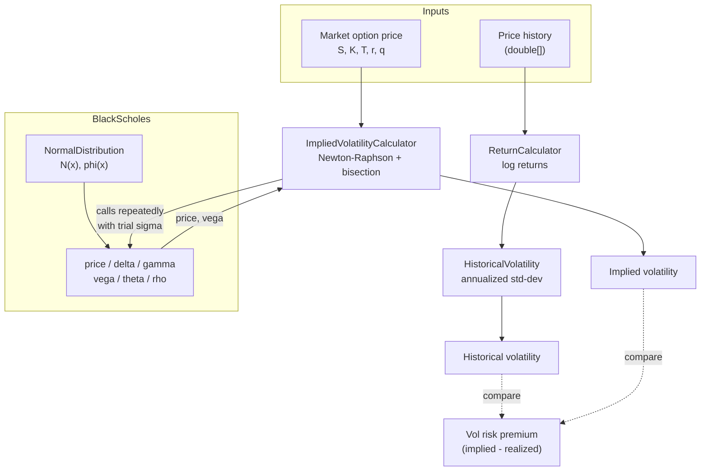

# Equity Volatility Lab

A small, dependency-free Java project for learning the core building blocks of
equity volatility analysis: turning a price history into a volatility number,
pricing a European option with Black-Scholes, and inverting that pricer to
recover the market's implied volatility.

Everything is plain Java 21 + JUnit 5 — no numerical libraries — so each
formula is fully visible in the source.

## What "equity volatility" actually means

Volatility is a measure of how much a stock's price moves, regardless of
direction — the annualized standard deviation of its returns. It shows up in
two flavors, and the gap between them is the whole game:

- **Realized (historical) volatility** — how much the stock *actually* moved,
  measured from its price history. This is `HistoricalVolatility` in this
  project: backward-looking, computed from real data, not an opinion.
- **Implied volatility** — how much the market is *pricing in* for future
  moves, back-solved from an option's quoted premium. This is what
  `ImpliedVolatilityCalculator` computes: forward-looking, an opinion embedded
  in a price, not a measurement.

Options are priced with volatility as an input (`BlackScholes.price(...,
sigma, ...)`), so an option's market price implies a volatility the same way
a bond's market price implies a yield. Implied volatility is usually higher
than subsequent realized volatility, on average — sellers of insurance charge
a premium for bearing the risk. That gap is called the **volatility risk
premium (VRP)**, shown as the `CMP` node in the architecture diagram below,
and it's the starting point for almost every institutional volatility
strategy.

## How hedge funds like Citadel and Millennium trade volatility

Citadel and Millennium are multi-strategy ("multi-manager") hedge funds:
instead of one big directional bet, they run hundreds of independent trading
"pods," each running a market-neutral strategy under a strict risk budget,
allocating capital toward pods that perform and cutting those that don't.
Volatility trading is one of the standard pod strategies in that model.
Publicly known approaches include:

- **Volatility risk premium harvesting.** Systematically sell options
  (or variance/volatility swaps) because implied volatility tends to run
  richer than what subsequently realizes, then hedge away the directional
  exposure so only the vol spread is left. This directly mirrors the
  `HistoricalVolatility` vs. `ImpliedVolatilityCalculator` comparison in this
  project — the trade only exists because those two numbers usually differ.
- **Delta-hedging and gamma scalping.** A market-neutral options book isn't
  static — as the underlying moves, `delta` (in `BlackScholes.delta`) drifts,
  so the position is rebalanced by trading the stock to stay flat. If realized
  volatility comes in higher than the volatility the option was bought/sold
  at, that rebalancing itself generates a profit (or loss) — this is what
  `gamma` measures the sensitivity of.
- **Dispersion trading.** A relative-value bet between an index's implied
  volatility and the implied volatilities of its individual constituents,
  exploiting the fact that stocks in an index are imperfectly correlated —
  selling index vol and buying single-stock vol (or vice versa) profits from
  correlation moving, independent of the market's direction.
- **Volatility surface / term-structure arbitrage.** Implied volatility isn't
  one number — it varies by strike (skew) and by expiry (term structure).
  Funds trade relative mispricings across that surface (e.g., calendar
  spreads, skew trades) using models like the one in `BlackScholes` as the
  common pricing yardstick across every strike and expiry.
- **Statistical arbitrage on volatility signals.** Realized-vol estimates
  (of the kind `HistoricalVolatility` produces, often with more sophisticated
  estimators — EWMA, GARCH, high-frequency realized variance) feed
  quantitative models that predict short-term vol regime shifts and trade
  options or vol futures/ETPs around that forecast.
- **Options market making.** Continuously quoting bid/ask on options,
  capturing the spread, and immediately delta-hedging every fill so the desk
  carries volatility exposure (not equity direction exposure) — this is close
  to a pure, high-volume version of the price/Greeks calculations this
  project implements, run at exchange speed and massive scale.

The common thread: every one of these strategies needs a fast, correct
options pricer and Greeks (`BlackScholes` here) as its pricing engine, and a
reliable way to compare "what the market thinks will happen" against "what
actually happens" (`ImpliedVolatilityCalculator` vs. `HistoricalVolatility`).
Real trading desks run far more sophisticated versions — stochastic
volatility models, high-frequency realized-variance estimators, cross-asset
hedging, and heavy risk overlays — but the two-numbers-and-a-pricer core is
exactly what's in this repository.

## What's inside

| Class | Purpose |
|---|---|
| `ReturnCalculator` | Converts a price series into log returns |
| `HistoricalVolatility` | Annualizes the sample standard deviation of returns ("realized" or "historical" volatility) |
| `NormalDistribution` | Standard normal PDF/CDF (package-private helper for Black-Scholes) |
| `BlackScholes` | European option price + Greeks (delta, gamma, vega, theta, rho) |
| `ImpliedVolatilityCalculator` | Solves for the volatility that reprices an option to its observed market price |

## Architecture



Two independent paths produce a volatility number — realized (backward-looking,
from historical prices) and implied (forward-looking, from a market price) —
and `BlackScholes` is the shared pricing engine that the implied-vol solver
drives iteratively. Comparing the two is the classic starting point for
volatility trading: the "volatility risk premium" is (implied − realized).

## Design considerations

**Log returns, not simple returns.** `ReturnCalculator` uses `ln(P_t / P_{t-1})`
instead of `(P_t - P_{t-1}) / P_{t-1}`. Log returns are time-additive (the
return over N periods is just the sum of the 1-period log returns), which is
what makes the square-root-of-time annualization in `HistoricalVolatility`
valid in the first place.

**Annualization is a parameter, not a constant.** `annualizedVolatility(prices,
periodsPerYear)` takes the periods-per-year explicitly (252 for daily equity
data, 52 for weekly, 12 for monthly) rather than hardcoding 252. Baking in a
trading-day assumption silently breaks the moment someone feeds in weekly
data.

**Sample (n-1) standard deviation.** Realized vol uses Bessel's correction
(`/(n-1)`) rather than the population standard deviation, matching the
convention in most vol-estimation literature and avoiding a small downward
bias on short windows.

**Continuous dividend yield `q` on every Black-Scholes call.** Rather than a
dividend-free variant, every pricing/Greek method takes a carry rate `q`. Set
`q = 0` for a non-dividend payer; the same code path handles indices, FX, and
futures-style carry by just changing `q`/`r`, which is closer to how these
formulas are actually used in practice.

**No external math dependency for the normal CDF.** `NormalDistribution` uses
the Abramowitz & Stegun 7.1.26 rational approximation (max error ≈ 1.5e-7)
instead of pulling in Apache Commons Math or similar, keeping the project
dependency-free and the formula inspectable.

**Implied vol: Newton-Raphson with a bisection safety net.** Newton-Raphson
(using Black-Scholes vega as the derivative) converges in a handful of
iterations near the money, but vega collapses toward zero for deep
in/out-of-the-money options, which can make a raw Newton step overshoot or
diverge. `ImpliedVolatilityCalculator` maintains a `[lowVol, highVol]`
bracket alongside the Newton iteration; any step that would leave the
bracket is replaced by a bisection step. This is the standard
"fast method first, robust method as fallback" pattern used in production
solvers — fast in the common case, guaranteed to converge in the edge case.

**Arbitrage bounds are checked before solving.** A European call can never be
worth less than its discounted intrinsic value (`S·e^{-qT} - K·e^{-rT}`) or
more than the discounted spot itself; puts have the symmetric bound. Feeding
`ImpliedVolatilityCalculator` a market price outside those bounds means the
input data is stale, crossed, or wrong — there is no volatility that
reproduces it, so it fails fast with `IllegalArgumentException` instead of
returning a bisection result that silently walked to a boundary.

**Greeks are unit-tested against finite differences, not just hand-derived
numbers.** Each closed-form Greek (`delta`, `gamma`, `vega`, `theta`, `rho`)
is cross-checked against a central-difference numerical derivative of
`price(...)` in `BlackScholesTest`. This is how you'd sanity-check a new
Greek formula in practice, and it catches sign/algebra errors that a single
hardcoded reference value might miss.

## Running

```bash
mvn test
```

27 tests across 4 test classes, covering:
- Log-return correctness and input validation
- Historical volatility against hand-computed reference values
- Black-Scholes price against a known textbook example (Hull, S=42 K=40
  r=10% σ=20% T=0.5y), put-call parity, and all five Greeks via finite
  differences
- Implied volatility round-trips (price → solve → recover the original σ)
  across ATM, deep ITM, and deep OTM strikes, plus arbitrage-bound rejection

## Example usage

```java
double[] prices = {100, 101.5, 99.8, 102.3, 101.0};
double realizedVol = HistoricalVolatility.annualizedVolatility(prices, 252);

double callPrice = BlackScholes.price(100, 105, 0.5, 0.05, 0.0, 0.22, OptionType.CALL);
double delta = BlackScholes.delta(100, 105, 0.5, 0.05, 0.0, 0.22, OptionType.CALL);

double impliedVol = ImpliedVolatilityCalculator.solve(callPrice, 100, 105, 0.5, 0.05, 0.0, OptionType.CALL);
```

## Suggested next steps for further learning

- Add a volatility surface (implied vol across strikes/expiries) built on top
  of `ImpliedVolatilityCalculator`
- Add an EWMA or GARCH(1,1) volatility estimator alongside the simple
  rolling-window `HistoricalVolatility`
- Add American-option pricing (binomial tree) to compare against the
  European Black-Scholes price
